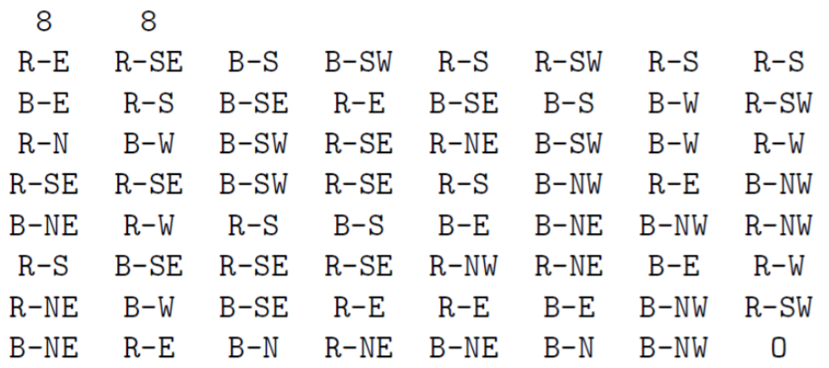

# Intro to Theory of Algorithms
## Project 2
### Thiago André Ferreira Medeiros
#### Packages needed to run the project
numpy~=1.19.5

There is a requirements.txt file to facilitated the import of packages.

#### How to run
The program must take two command line parameters: (1) the input file name; and (2) the output file name. See below for an example.

python Project2.py input.txt output.txt

#### Path
The program finds a route from the arrow in the top left corner to the bullseye in the bottom right corner.
The program follows the direction that the arrows point, and can only stop on the other colored arrow or the bullseye.
For example, start on red, then chose a blue arrow (in the direction that the red arrow is pointing), then from the blue
arrow chose a red arrow in the direction the blue arrow is pointing. Continue in this fashion until
it finds the bullseye in the bottom right corner. It does not have to be the first opposite color that it finds.

#### Input file
The input begins with
two positive characters on a line indicating the number of rows r and columns c of the maze, respectively. The next r lines contain the color and directional information for each arrow in the
maze. Each line has c values, where each value represents the color of the arrow by the direction of the arrow (N, E, S, W, NE, SE, SW, or NW). The color codes R and B represent red and
blue, respectively, while the direction codes represent north, east, south, west, northeast, southeast, southwest, or northwest, respectively. The bulls-eye is represented by the letter O.
It is assumed that the bulls-eye will always be in the bottom-right corner of the maze.

#### Output file
The output consists of a path from the top left square to the bottom right square (bulls-eye).
It is a single line consisting of a sequence of moves, separated by spaces. Each move should be
represented by the number of spaces to move and the direction, with no spaces in between.
The direction is represented using N, E, S, W, NE, SE, SW, and NW, as in the input.
The sequence of moves solve the maze from the input. For example, if the first 3 moves
take 3 spaces east, 3 spaces southwest, and 4 spaces southeast, the output should begin as follows
(note, the 3 moves below correspond to the first three possible moves to the graph above): 3E 3SW 4SE